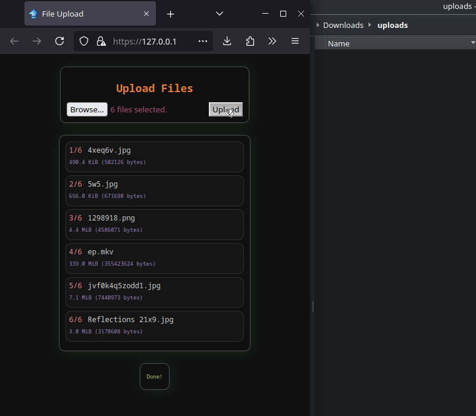

# dumpit-c

Easily transfer files from a phone to a PC over wifi.



# Installation
```sh
make
sudo make install
```

## Requirements
* gcc

# Running
```sh
dumpit -d <uploads>
```

# Usage
Open the server's IP address in a web browser and begin uploading files.
